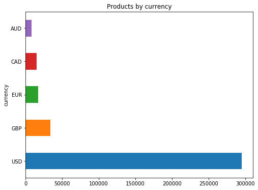
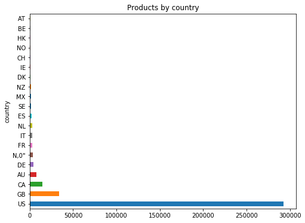
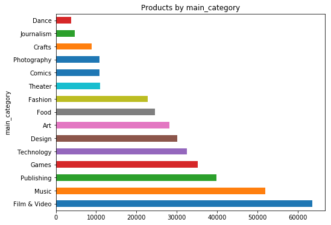
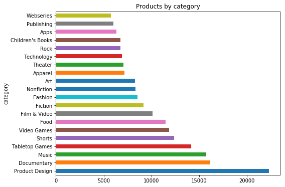

# Kickstarter: Will you make it through?

In the past decade, crowdfunding websites like Kickstarter have made it much simpler to gain funding for a new product, idea or a company. They brand themselves as a new and revolutionary way to build businesses. Here, we take a look at all the Kickstarter campaigns for the year 2018. 

## US Dominates the Crowdsourcing Market 

In the year 2018, there were a total of 378661 kickstarter projects. Out of those, over 300,000 used US currency. It is well known that US currency is dominant in the world for international transactions. It seems as though out of all 370k transactions, over 300,000 used US currency.

Furthermore, the United States does not just lead in terms of the currency usage. The US leads overall in terms of number of projects, number of backers and amount backed. The US's contribution almost doubles all the other countries combined. 

Although this is a more than expected trend as Kickstarter is mainly known in the United States.

## Most products are regarding Film and Video

From the entire dataset, 'Film and Video' tops the list of campaign categories. Closest to film and video is music, another category of art.

Technology and Design are 5th and 6th positions respectively. 

Looking into the specific characteristics of data types, "product design" tops the list of categories however the documentary is the second most popular item. 

### Video and Film Products

Looking into the film and video category, 

### Technology Products

